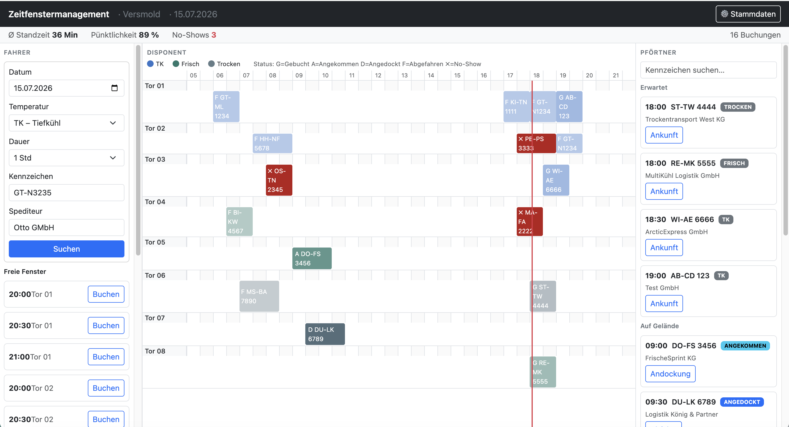

# Zeitfenstermanagement

A **time-slot booking system for unloading docks** at a food-logistics warehouse —
built as a full-stack demo project using the exact technology stack of the Nagel-Group
engineering team: **Go · SQLite (PostgreSQL-ready) · TypeScript · Vue 3**.

> **Domain context.** Nagel-Group operates 130+ depot locations and ~105 000 deliveries
> per day. Without slot booking, every carrier arrives at 06:00 on Monday and sixteen
> trucks queue at the gate. A refrigerated trailer idles its engine the whole time
> (fuel, emissions, cold-chain risk), the driver burns legally-regulated *Lenkzeit*,
> and the depot pays *Standgeld* for every hour of delay. This system replaces the live
> queue with a distributed-in-time schedule — and **measures whether it actually works**.

---

## Demo console



> **Ø Standzeit 36 Min · Pünktlichkeit 89 % · No-Shows 3** — KPI recalculates live on
> every gate event. The red vertical line marks the current time. Block colour = temperature
> class (blue TK, teal Frisch, grey Trocken); block prefix = gate status
> (F=Abgefahren, A=Angekommen, D=Angedockt, ×=No-Show, G=Gebucht).

---

## What it does

| Role | What they see |
|---|---|
| **Fahrer** (driver) | Searches for a free slot by temperature class & duration, books it, can cancel |
| **Disponent** (dispatcher) | Day-view Gantt timeline across all docks; colour = temp class, shape = gate status |
| **Pförtner** (gatekeeper) | Searches by licence plate, presses **Ankunft → Andockung → Abfahrt** — only the valid next step is active |
| **Admin** | Stammdaten drawer: sites, docks, temperature capabilities, soft deactivation |

**KPI bar** (top of screen) shows Ø *Standzeit*, *Pünktlichkeit*, and *No-Shows* for the
day — recalculated live on every state change.

This is a **demo console**: all three roles are visible simultaneously so the data flow can
be observed in real time without switching views. In production each role lives on its own
device; the architecture already isolates their concerns.

---

## Tech stack

### Backend — Go

| Concern | Approach |
|---|---|
| HTTP | `net/http` standard library, no framework |
| Database | `modernc.org/sqlite` (pure Go, CGO-free) + **goose** migrations |
| Domain layer | Pure Go structs & functions — zero DB imports, fully unit-testable |
| Configuration | Environment variables only (`ZFM_ADDR`, `ZFM_DB_PATH`, `ZFM_LOG_LEVEL`) |
| API contract | `api/openapi.yaml` — single source of truth for both backend and generated TS types |

> **Why SQLite, not PostgreSQL?**  
> SQLite is the right fit for a self-contained demo that runs with a single binary and
> zero infrastructure. The domain model was designed with PostgreSQL in mind:
> `BuchungSlot` exists precisely because SQLite lacks partial `EXCLUDE` constraints
> (`WHERE storniert_am IS NULL`). In PostgreSQL the slot-index table disappears and the
> constraint moves to the DB engine — a concrete architectural trade-off documented in
> [`agentic_docs/MVP.md §5`](agentic_docs/MVP.md).

### Frontend — Vue 3 + TypeScript

| Concern | Decision | Why |
|---|---|---|
| Framework | Vue 3 Composition API, `<script setup>` only | Closest to React hooks; no Options API dialect in the codebase |
| Types | `strict: true`, generated from OpenAPI | Prevents backend/frontend contract drift at compile time |
| UI kit | Bootstrap 5 CSS only (no Bootstrap JS) | German enterprise standard; Bootstrap JS conflicts with Vue's DOM ownership |
| State | Pinia — one shared `buchungen` store | All three panels read the same store → instant cross-panel reactivity, no SSE needed |
| HTTP | Custom `fetch` wrapper (`src/api/client.ts`, ~65 lines) | No axios: `fetch` covers all our needs; axios brought zero features we actually use |
| Router | None | Single-page console; no routes to manage |

---

## Domain model

```
STANDORT ──< RAMPE ──< RAMPE_TEMPERATURBEREICH
                  └──< BUCHUNG ──< BUCHUNG_SLOT
                            └──< BUCHUNG_EREIGNIS
```

**Temperature classes** (`Temperaturbereich`): `TK` (−18 °C frozen) · `FRISCH` (+2…+7 °C chilled) · `TROCKEN` (ambient).  
A dock can support multiple classes. Booking frozen cargo onto a non-TK dock is a domain violation — rejected in the domain layer before touching the DB.

**Booking status** is a pure function of gate events, not a stored field:

```
GEBUCHT → ANGEKOMMEN → ANGEDOCKT → ABGEFAHREN
   └─ (no arrival after beginn + 15 min Karenzzeit) → NO_SHOW  [computed, never stored]
```

**Slot index** (`BuchungSlot`): one row per 30-minute grid cell, `PRIMARY KEY (rampe_id, slot_beginn)`.
A 90-minute booking inserts three rows in one transaction; any conflict fails the whole transaction — the only correct way to prevent double-booking under concurrent writes.

---

## Business rules (selected)

All rules live in the domain package and are tested **without any DB connection**:

| # | Rule | Layer | Error → HTTP |
|---|---|---|---|
| 1 | No two bookings may share a slot on the same dock | DB constraint | `ErrRampeBelegt` → 409 |
| 2 | Cargo temperature class must be supported by the dock | Domain | `ErrTemperaturMismatch` → 422 |
| 3 | Booking must fall within the site's *Öffnungszeiten* (in site's IANA timezone) | Domain | `ErrAusserhalbOeffnungszeit` → 422 |
| 4–5 | Slot boundaries on 30-min grid; duration 30 min – 4 h | Domain | 422 |
| 6 | Cannot book in the past | Domain | `ErrVergangenheit` → 422 |
| 15 | Cannot deactivate a dock that has future active bookings | Domain | `ErrRampeHatBuchungen` → 409 |
| 16 | Cannot remove a temperature class from a dock if future bookings use it | Domain | `ErrRampeHatBuchungen` → 409 |

Rule 1 is intentionally handled by the DB constraint, not application code — checking
"is it free?" before inserting is a race condition. Rules 2–16 are pure functions over
data: ideal for table-driven tests.

---

## API overview

```
GET  /api/v1/verfuegbarkeit?standort_id=&datum=&temperaturbereich=&dauer=
GET  /api/v1/buchungen?standort_id=&datum=
POST /api/v1/buchungen
DEL  /api/v1/buchungen/{id}
POST /api/v1/buchungen/{id}/ereignisse      {"typ":"ANGEKOMMEN"}
GET  /api/v1/kennzahlen?standort_id=&datum=

GET   /api/v1/standorte
POST  /api/v1/standorte
PATCH /api/v1/standorte/{id}
GET   /api/v1/standorte/{id}/rampen
POST  /api/v1/standorte/{id}/rampen
PATCH /api/v1/rampen/{id}
```

`datum` is the **site's local date**, not UTC. The server resolves day boundaries using
the site's IANA timezone — so `datum=2026-07-20` for Versmold (`Europe/Berlin`) maps to
`[2026-07-19T22:00Z, 2026-07-20T22:00Z)` in summer.

Errors always carry a machine-readable `code` alongside the HTTP status:
```json
{ "code": "RAMPE_BELEGT", "message": "Rampe ist zu dieser Zeit bereits belegt" }
```
Because `409` means three different things in this API, the status alone is not enough
for the client to branch on.

---

## Getting started

### Prerequisites

- Go 1.21+
- Node.js 20+ / npm

### Backend

```bash
cd server_go
go run . migrate          # runs goose migrations
go run . seed             # populates today's data (arrives, docked, departed, one no-show)
go run .                  # starts on :8080
```

Environment variables (all optional):

| Variable | Default |
|---|---|
| `ZFM_ADDR` | `:8080` |
| `ZFM_DB_PATH` | `./zeitfenster.db` |
| `ZFM_LOG_LEVEL` | `info` |

### Frontend

```bash
cd client_vue
npm ci
npm run dev               # starts on http://localhost:5173
```

The Vite dev server proxies `/api` to `:8080`. CORS is open for `localhost:5173` in dev mode.

### Build (production)

```bash
cd client_vue && npm run build    # outputs to client_vue/dist/
# The Go server serves dist/ as static files at /
cd server_go && go build -o zeitfenster .
./zeitfenster
```

---

## Project structure

```
Zeitfenstermanagement/
├── server_go/
│   ├── internal/
│   │   ├── domain/          # pure business logic — no DB, no HTTP
│   │   ├── store/           # SQLite queries (goose migrations)
│   │   └── httpapi/         # HTTP handlers + error mapping (fehler.go)
│   ├── cmd/seed/            # demo data seeder
│   └── api/openapi.yaml     # contract — source of truth for TS types
└── client_vue/src/
    ├── components/
    │   ├── FahrerPanel.vue
    │   ├── DisponentPanel.vue   # Gantt timeline (custom CSS Grid)
    │   ├── PfoertnerPanel.vue
    │   └── StammdatenDrawer.vue
    ├── stores/
    │   ├── buchungen.ts         # shared real-time source for all panels
    │   └── stammdaten.ts
    └── api/
        ├── client.ts           # typed fetch wrapper
        └── types.ts            # generated from openapi.yaml
```

---

## Conscious scope decisions

This is a **learning project** with a deliberately defined boundary — completeness over
breadth. What was left out is documented as a decision, not an oversight:

- **SQLite → PostgreSQL**: SQLite for zero-setup demo; the model is designed to migrate cleanly (see domain model note above)
- **No auth / single-page console**: roles are visible simultaneously to show data flow; production would have RBAC + separate device apps
- **Spediteur = Fahrer**: one actor instead of two; split returns with user accounts
- **Single opening-hours range**: Mon–Fri same schedule; full per-day + *Feiertage* + *Sperrzeiten* are roadmapped
- **No SSE**: shared Pinia store gives instant cross-panel updates within one browser tab; multi-browser sync would require SSE (roadmapped as §10.I)

Full roadmap including Umbuchung (atomic slot swap), Dauerbuchungen, SAP S/4HANA
integration, carrier scoring, and multi-browser sync is in [`agentic_docs/MVP.md §10`](agentic_docs/MVP.md).

---

## What this demonstrates

- **Go**: clean domain/store/http layering; domain logic independent of infrastructure; custom error types mapped to HTTP codes at a single boundary (`fehler.go`)
- **TypeScript + Vue 3**: Composition API with `<script setup>`; strict types from OpenAPI contract; reactive state shared across components without a bus or events
- **SQL**: slot-index design to enforce double-booking prevention at the DB level; soft deletes; timezone-aware date queries
- **Full-stack feature ownership**: a booking created in the Fahrer panel appears instantly in the Disponent timeline and the Pförtner queue — one round-trip, no coordination
- **Domain modelling**: temperature-class constraints, state machine for gate events, computed KPIs as pure functions — all testable without infrastructure
