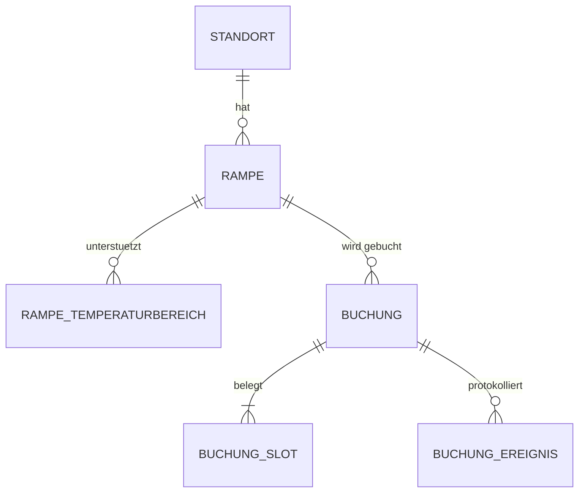

# MVP.md — Zeitfenstermanagement

Fachliche Projektbeschreibung: was wir bauen, warum es in der realen Welt gebraucht wird und woraus es besteht.
Coding-Konventionen — siehe allgemein `../../agentic_docs/CONVENTIONS.md`.

---

## 1. Was ist das

**Zeitfenstermanagement (ZFM)** — ein System zur Buchung von Zeitfenstern an den Entladerrampen eines Logistiklagers.

Der Spediteur bucht im Voraus ein konkretes Fenster an einer konkreten Rampe: «LKW Spedition Müller,
Rampe 12, Montag 06:30–07:30, Tiefkühlware». Das Lager sieht einen gleichmäßigen Tagesplan statt einer
Fahrzeugschlange vor den Toren. An den Toren werden Ankunft und Abfahrt erfasst — daraus lässt sich
ablesen, ob das System überhaupt funktioniert.

In einem Satz: **eine zeitlich verteilte Warteschlange statt einer echten, mit Erfolgsmessung.**

Das System ist mehrrollig: Fahrer, Disponent und Pförtner haben unterschiedliche Aufgaben. Im echten
Produkt sind das verschiedene Geräte, bei uns — **eine Demo-Konsole**, in der alle drei Panels
gleichzeitig sichtbar sind und der Datenfluss zwischen ihnen live beobachtet werden kann (§8).

---

## 2. Das Problem in der realen Welt

### So sieht es ohne ZFM aus

Depot in Versmold, 24 Rampen. Montag, 06:00 Uhr. Alle Spediteure wollen früh entladen,
also kommen sie gleichzeitig — sechzehn Fahrzeuge auf einmal an den Toren.

- **Warteschlange.** Der Kühler von Müller steht als siebter in der Reihe und wartet drei Stunden.
- **Der Motor läuft die ganze Zeit** — das Kühlaggregat darf nicht abgeschaltet werden, sonst taut
  die Ware auf. Kraftstoff, Emissionen, Verschleiß.
- **Der Fahrer verbraucht Lenkzeit.** Die Lenkzeit ist durch EU-Recht streng begrenzt
  (VO (EG) 561/2006). Drei Stunden in der Warteschlange bedeuten drei Stunden, die er heute nicht
  mehr fahren kann. Der Stillstand bricht nicht nur eine Fahrt, sondern die gesamte Tageskette.
- **Standgeld.** Für den Stillstand stellt der Spediteur dem Lager eine Rechnung. Das sind direkte Kosten.
- **Das Lager ist von 06:00 bis 09:00 im Stress und ab 11:00 unterbeschäftigt.** Personal wurde für
  den Spitzenbedarf eingestellt, wird aber den ganzen Tag bezahlt.
- **Kühlkettenrisiko.** Tiefkühlware bei −18 °C verzeiht keine Wartezeiten. Jedes unnötige Öffnen der
  Türen und jede Stunde in der Sonne birgt das Risiko einer Temperaturabweichung — das bedeutet
  Palettenabschreibung und einen Eintrag ins HACCP-Protokoll.

### So sieht es mit ZFM aus

Müller bucht am Vortag das Fenster 06:30–07:30 an Rampe 12 — sie ist TK-ausgestattet. Er kommt um
06:25 an, steht um 06:30 am Tor, fährt um 07:15 ab. Das Lager ist gleichmäßig über den ganzen Tag
ausgelastet, das Personal nach Bedarf verteilt, der Kühler läuft nicht unnötig.

### Was das System optimiert

| Metrik | Bedeutung | Berechnung |
|---|---|---|
| **Standzeit** | Zeit von der Ankunft bis zur Abfahrt — der wichtigste KPI, den wir senken wollen | `Abfahrt − Ankunft` |
| **Pünktlichkeit** | Anteil der Fahrzeuge, die pünktlich in ihrem Fenster ankamen | `Ankunft` vs `beginn` ± Karenzzeit |
| **No-Show** | gebucht und nicht erschienen — der Slot stand leer | kein `Ankunft`-Ereignis bis `beginn` + Karenzzeit |
| **Auslastung** | wie viel Prozent der Betriebszeit die Rampe tatsächlich belegt ist | aus den Buchungen selbst |

> **Warum der MVP Gate-Ereignisse enthält.** Die ersten drei Metriken lassen sich nicht berechnen,
> wenn man nur die Buchung kennt. Ein System, dessen Mehrwert darin besteht, die Standzeit zu senken,
> muss die Standzeit auch messen können — sonst kann es seinen eigenen Nutzen nicht beweisen. Daher
> `BuchungEreignis` (§5) und das Pförtner-Panel (§8).

---

## 3. Domäne: Lebensmittellogistik

Das Projekt ist in der Domäne der **Nagel-Group** angesiedelt — dem größten Lebensmittellogistiknetzwerk
Europas: ~105 000 Sendungen pro Tag, 130+ Standorte, über 10 000 Mitarbeiter.

Der wesentliche Unterschied zur allgemeinen Logistik ist der **Temperaturbereich**. Die Ware kann nicht
einfach an beliebige freie Tore gestellt werden: Die Rampe muss für den erforderlichen Temperaturbereich
ausgestattet sein.

| Temperaturbereich | Regime | Was transportiert wird | Anforderungen an die Rampe |
|---|---|---|---|
| **TK** (Tiefkühl) | ≈ −18 °C | Tiefkühlware: Pizza, Eis, Gemüse | abgedichteter Dockshelter, Schleuse, minimale Zeit mit offenen Türen |
| **FRISCH** | ≈ +2…+7 °C | Milchprodukte, Fleisch, frisches Gemüse | gekühlte Zone |
| **TROCKEN** | Umgebungstemperatur | Konserven, Getreide, Getränke | normale Tore |

Daraus ergibt sich die **zentrale Domänenregel** des Projekts, die es im gewöhnlichen Slot-Booking
nicht gibt: Eine Buchung für Tiefkühlware kann nur an einer Rampe platziert werden, die TK unterstützt.
Eine Rampe kann mehrere Temperaturbereiche unterstützen.

Die zweite Konsequenz: **Zeit ist wertvoller als in der Trockenlogistik**. Daher ein 30-Minuten-Raster
statt «kommen Sie in der ersten Tageshälfte».

---

## 4. MVP-Umfang

### Enthalten

- **Demo-Konsole**: drei Panels auf einem Bildschirm (Fahrer · Disponent · Pförtner) + Stammdaten
  in einem Drawer. Der Datenfluss zwischen den Panels ist live sichtbar (§8)
- **Stammdaten-CRUD**: Standorte und Rampen, Zuweisung von Temperaturbereichen, Deaktivierung
- Suche nach freien Fenstern nach Temperaturbereich und Dauer, Buchungserstellung, Stornierung
- **Gate-Ereignisse**: Ankunft → Andockung → Abfahrt mit Überprüfung der zulässigen Übergänge
- **Tages-KPIs**: Ø Standzeit, Pünktlichkeit, No-Shows — werden live neu berechnet
- Tages-Zeitplan: Rampen vertikal, Zeit horizontal, Status durch Blockdarstellung

### Bewusste Vereinfachungen

> **Spediteur = Fahrer.** In der Realität sind das unterschiedliche Akteure: Der Disponent des
> Spediteurs bucht vom Büro aus, der Fahrer kommt an. Wir fassen sie zu einem zusammen — «Der Fahrer
> bucht sein eigenes Fenster». Die Trennung kehrt mit Benutzerkonten zurück (§10.E), im Moment fügt
> sie eine Entität hinzu, ohne dem Demo-Wert etwas beizutragen.
>
> **Keine Authentifizierung, keine Rollenauswahl.** Alle Panels sind sofort sichtbar — es gibt niemanden,
> der und nichts, was man auswählen müsste. Das ist eine Demo-Konsole, kein Produkt: Im echten Leben
> nutzt der Fahrer ein Telefon, der Pförtner ein Terminal an der Pforte, der Disponent einen Desktop —
> und gemeinsam auf einem Bildschirm sind sie nie. So sollte es auch im README stehen — das ist eine
> bewusste Präsentation, keine Naivität.
>
> **Öffnungszeiten — ein Zeitraum für alle Tage.** In der Realität: Mo–Fr 05:00–22:00,
> Sa 06:00–14:00, So geschlossen, plus Feiertage und Sperrzeiten (§10.A).

### Nicht enthalten

Die vollständige Auflistung findet sich in §10 Roadmap. Kurz: Umbuchung (Verschiebung),
Dauerbuchungen, Benachrichtigungen, Berichte und Export, SAP-Integration, Yard Management,
Mehrsprachigkeit, echtes RBAC, Browser-übergreifende Synchronisierung.

Scope-Disziplin ist hier Teil des Sinns. Dies ist ein Lernprojekt, das **abgeschlossen** sein soll —
kein halb fertiggestelltes Enterprise-System.

---

## 5. Entitäten



### Standort — Niederlassung

Filiale/Depot. Wird über den Stammdaten-Drawer verwaltet.

| Feld | Typ | Bedeutung |
|---|---|---|
| `id` | int64 | |
| `name` | string | «Versmold» |
| `adresse` | string | |
| `zeitzone` | string | IANA-Zeitzone, `Europe/Berlin` |
| `oeffnung_von` / `oeffnung_bis` | local time | Betriebszeiten, **lokal** — 05:00–22:00 |
| `aktiv` | bool | Deaktivierung statt Löschung |

> **Warum die Zeitzone ein eigenes Feld ist.** In der Datenbank wird alles in UTC gespeichert
> (§8 CONVENTIONS), aber «das Lager öffnet um 05:00» ist Ortszeit. Ohne die Zeitzone kann die Regel
> «Buchung innerhalb der Öffnungszeiten» nicht geprüft werden, und die Sommerzeitumstellung würde
> alles kaputtmachen. Im europaweiten Netzwerk liegen Standorte in unterschiedlichen Zeitzonen.

### Rampe — Ladetor

| Feld | Typ | Bedeutung |
|---|---|---|
| `id` | int64 | |
| `standort_id` | int64 | → Standort |
| `bezeichnung` | string | «Tor 12» |
| `temperaturbereiche` | set | welche Temperaturbereiche unterstützt werden — eine **Menge**, kein Einzelwert |
| `aktiv` | bool | die Rampe kann in Reparatur sein |

Die Menge der Temperaturbereiche wird in SQLite als Verknüpfungstabelle
`rampe_temperaturbereich (rampe_id, temperaturbereich)` abgebildet.

### Temperaturbereich — Temperaturzone

Value-Object, keine Tabelle. Enum: `TK` | `FRISCH` | `TROCKEN`.

In der Domäne ist es ein eigener Typ mit Garantien (`zeitfenster.Temperaturbereich`), im Transport
eine Zeichenkette. Die Umwandlung erfolgt in `httpapi`, siehe §10 CONVENTIONS.

### Buchung — Reservierung

Die zentrale Entität, um die sich alles dreht.

| Feld | Typ | Bedeutung |
|---|---|---|
| `id` | int64 | |
| `rampe_id` | int64 | → Rampe |
| `spediteur` | string | «Spedition Müller» — **er ist auch der Fahrer** (§4). Im MVP Text, keine Entität |
| `kennzeichen` | string | Fahrzeugkennzeichen, «GT-ML 1234» — **damit identifiziert der Pförtner das Fahrzeug** |
| `sendung_nr` | string | Sendungsnummer. Im MVP ein Freitextfeld |
| `temperaturbereich` | Temperaturbereich | Temperaturbereich der Ware |
| `beginn` / `ende` | time (UTC) | Fenstergrenzen, am Raster ausgerichtet |
| `erstellt_am` | time (UTC) | |
| `storniert_am` | *time (UTC) | `nil` = nicht storniert |

Hinweis: **Es gibt kein Feld `status`**. Der Status wird aus den Ereignissen berechnet, siehe unten.

### BuchungSlot — belegter Slot

Eine technische Entität, aber fachlich bedeutsam: **Es ist der Belegungs-Index**.

| Feld | Typ |
|---|---|
| `rampe_id` | int64 |
| `slot_beginn` | time (UTC), am 30-Min-Raster ausgerichtet |
| `buchung_id` | int64 → Buchung |

`PRIMARY KEY (rampe_id, slot_beginn)` — das ist die Garantie «eine Rampe, ein Slot, eine Buchung».
Eine 90-minütige Buchung fügt drei Zeilen in einer Transaktion ein; kollidiert auch nur eine davon,
schlägt die gesamte Transaktion fehl.

> **Rasterarithmetik — `ende` ist exklusiv.** Das Buchungsintervall ist `[beginn, ende)`:
>
> ```
> Slots(b) = { beginn, beginn+30m, …, ende−30m }
> len       = (ende − beginn) / 30min          → von 1 bis 8 (Regel 5)
> ```
>
> Eine Buchung 06:30–07:30 belegt **zwei** Slots (06:30 und 07:00), nicht drei: 07:30 bleibt für
> das nächste Fahrzeug frei. Eine Buchung 06:30–08:00 belegt drei Slots.
>
> Das ist bewusst festgehalten, weil dies der Off-by-One-Fehler ist, der die zentrale Constraint
> still bricht: Bei inklusiver Interpretation würde jede Buchung eine halbe Stunde extra blockieren,
> und niemandem würde es auffallen, bis die Rampe bei 60 % Auslastung «überlastet» wäre.

> **Zentrales Modelldetail.** `Buchung` ist die **Aufzeichnung**, `BuchungSlot` ist die **Belegung**.
> Stornierung = `storniert_am` setzen **und die Slot-Zeilen löschen** in einer Transaktion.
> Die Historie bleibt erhalten, die Slots werden freigegeben. Werden die Zeilen nicht gelöscht,
> bleibt die Rampe durch die stornierte Buchung belegt.
>
> In PostgreSQL wird das anders gelöst — mit einem partiellen `EXCLUDE`-Constraint
> `WHERE (storniert_am IS NULL)`, und die separate Tabelle entfällt ganz. Ein gutes Beispiel dafür,
> wie Datenbankfähigkeiten das Modell beeinflussen. Im Cold-Chain-Projekt werden wir die zweite
> Variante sehen.

### BuchungEreignis — Gate-Ereignis

Was physisch mit dem Fahrzeug passiert ist. Append-only-Log.

| Feld | Typ | Bedeutung |
|---|---|---|
| `id` | int64 | |
| `buchung_id` | int64 | → Buchung |
| `typ` | enum | `ANGEKOMMEN` \| `ANGEDOCKT` \| `ABGEFAHREN` — nur physisch beobachtbare Fakten |
| `zeitpunkt` | time (UTC) | Zeitpunkt des Ereignisses |
| `erfasst_von` | string | wer erfasst hat (im MVP ein Freitextfeld, keine Rollen) |

`UNIQUE (buchung_id, typ)` — jedes Ereignis tritt genau einmal auf.

> **Ereignisse sind die Wahrheit, Status ist eine Projektion.** Wir speichern keinen `status` auf
> der `Buchung`, sondern berechnen ihn in der Domäne aus der Ereignisliste. Begründung:
> Denormalisierung führt zu Inkonsistenz (Status sagt das eine, Ereignisse das andere — wem glaubt
> man?), und bei Tagesvolumina kostet die Berechnung nichts. Wird es langsam — denormalisieren wir,
> aber nicht früher (YAGNI, §2 CONVENTIONS).

**Berechneter Status** — eine reine Funktion `Status(ereignisse, storniert_am, beginn, now)`:

```
STORNIERT     ← storniert_am != nil
ABGEFAHREN    ← есть событие ABGEFAHREN
ANGEDOCKT     ← есть ANGEDOCKT
ANGEKOMMEN    ← есть ANGEKOMMEN
NO_SHOW       ← событий нет && now > beginn + Karenzzeit
GEBUCHT       ← иначе
```

> **NO_SHOW ist kein Ereignis, sondern eine Berechnung.** Es wird von niemandem beobachtet oder
> erfasst: Es ist das *Ausbleiben* der Ankunft zum vorgesehenen Zeitpunkt. Deshalb gibt es keinen
> Eintrag im Log und keine Schaltfläche beim Pförtner — er erscheint von selbst, wenn die Zeit
> abgelaufen ist. Nebenwirkung: «ein NO_SHOW» im Seeder ist einfach eine gestrige Buchung ohne
> Ereignisse — es muss nichts extra angelegt werden.

### Bewusst KEINE Entitäten im MVP

- **Spediteur / Fahrer** — einfacher Text, und das ist ein einziger Akteur (§4).
- **Sendung** — nur eine Nummer. Wird im Cold-Chain-Projekt zur eigenständigen Entität.
- **Benutzer** — keine Authentifizierung, `erfasst_von` ist eine reine Zeichenkette.

---

## 6. Geschäftsregeln

Regel 1 lebt in der Datenbank, alle weiteren im Domänenpaket und werden **ohne jede DB-Verbindung**
getestet (§3, §13 CONVENTIONS).

### Buchungserstellung

| # | Regel | Schicht | Fehler |
|---|---|---|---|
| 1 | Zwei Buchungen dürfen nicht denselben Slot derselben Rampe belegen | **DB-Constraint** | `ErrRampeBelegt` → 409 |
| 2 | Der Temperaturbereich der Ware muss von der Rampe unterstützt werden | Domäne | `ErrTemperaturMismatch` → 422 |
| 3 | Die Buchung muss vollständig innerhalb der Öffnungszeiten des Standorts liegen (in dessen Zeitzone) | Domäne | `ErrAusserhalbOeffnungszeit` → 422 |
| 4 | `beginn` und `ende` sind am 30-Minuten-Raster ausgerichtet | Domäne | `ErrNichtImRaster` → 422 |
| 5 | Dauer: mindestens 30 Min, maximal 4 Stunden | Domäne | `ErrUngueltigeDauer` → 422 |
| 6 | Buchungen in der Vergangenheit sind nicht erlaubt | Domäne | `ErrVergangenheit` → 422 |
| 7 | Rampe und Standort müssen `aktiv` sein | Domäne | `ErrRampeInaktiv` → 422 |

Regel 1 ist die einzige, die im Anwendungscode **nicht korrekt** umgesetzt werden kann: Eine
«Ist es frei?»-Prüfung vor dem Einfügen ist eine Race Condition. Sie wird durch die DB sichergestellt,
Go fängt die Constraint-Verletzung ab. Regeln 2–7 sind reine Funktionen über Daten — ideales Material
für tabellengesteuerte Tests.

### Gate-Ereignisse (Zustandsautomat)

```
GEBUCHT ──Ankunft──► ANGEKOMMEN ──Andockung──► ANGEDOCKT ──Abfahrt──► ABGEFAHREN
   ┊
   ┊ (gestrichelt = kein Übergang, sondern eine Berechnung: keine Ereignisse und Zeit abgelaufen)
   └╌╌╌► NO_SHOW
```

| # | Regel | Fehler |
|---|---|---|
| 8 | `ANGEKOMMEN` — nur aus `GEBUCHT` | `ErrUngueltigerStatuswechsel` → 409 |
| 9 | `ANGEDOCKT` — nur nach `ANGEKOMMEN` | `ErrUngueltigerStatuswechsel` → 409 |
| 10 | `ABGEFAHREN` — nur nach `ANGEDOCKT` | `ErrUngueltigerStatuswechsel` → 409 |
| 11 | Eine stornierte Buchung kann keine Ereignisse erhalten | `ErrBuchungStorniert` → 409 |
| 12 | Jedes Ereignis darf höchstens einmal auftreten | `UNIQUE` in DB + Domäne |

Es gibt genau drei Ereignisse — nur das, was eine Person am Tor physisch beobachtet hat. `NO_SHOW`
ist keine Regel: Es ist eine Berechnung, kein Übergang (siehe §5).

Der gesamte Zustandsautomat ist **eine reine Funktion der Ereignisliste**. Kein einziger
Datenbankzugriff — idealer tabellengesteuerter Test.

**Karenzzeit** (Verspätungspuffer) — 15 Minuten. Im MVP eine Domänenkonstante.

### Stammdaten

| # | Regel | Fehler |
|---|---|---|
| 14 | **Stammdaten werden nicht gelöscht, sondern deaktiviert** — auf sie verweist die Buchungshistorie | — |
| 15 | Eine Rampe kann nicht deaktiviert werden, solange zukünftige aktive Buchungen auf sie verweisen | `ErrRampeHatBuchungen` → 409 |
| 16 | Ein Temperaturbereich kann einer Rampe nicht entzogen werden, wenn für diesen Bereich zukünftige Buchungen bestehen | `ErrRampeHatBuchungen` → 409 |
| 17 | Ein Standort kann nicht deaktiviert werden, solange er aktive Rampen hat | `ErrStandortHatRampen` → 409 |
| 18 | Die `bezeichnung` einer Rampe ist innerhalb eines Standorts eindeutig | `UNIQUE` in DB → 409 |
| 19 | `zeitzone` muss eine gültige IANA-Zeitzone sein | `ErrUngueltigeZeitzone` → 422 |
| 20 | Eine Rampe muss mindestens einen Temperaturbereich haben | `ErrKeinTemperaturbereich` → 422 |

Regel 14 ist grundlegendes Enterprise-Wissen: Stammdaten leben in der Historie, deshalb greift
`DELETE` sie nicht an. Regel 16 ist die subtilste: Wird der TK-Temperaturbereich von Rampe 12
entfernt, aber für Donnerstag ist dort bereits Tiefkühlware gebucht, ergibt sich ohne Prüfung eine
Buchung, die Regel 2 verletzt.

### KPI-Berechnung

Reine Funktionen über Buchungen und Ereignisse:

- `Standzeit(b) = ABGEFAHREN.zeitpunkt − ANGEKOMMEN.zeitpunkt`
  — wird nur für Buchungen berechnet, bei denen beide Ereignisse vorliegen
- `Puenktlich(b) = ANGEKOMMEN.zeitpunkt ≤ b.beginn + Karenzzeit`
  — **nur Verspätung wird bewertet**. Zu früh ankommen ist keine Verletzung: Der Hof ist groß,
  und «Pünktlichkeit» über den Absolutbetrag der Differenz zu erklären, wäre für jeden erklärungsbedürftig
- `NoShow(b, now) = kein ANGEKOMMEN && now > b.beginn + Karenzzeit`
- `Auslastung(rampe, tag) = Summe belegter Slots / Gesamtanzahl Slots während der Öffnungszeiten`

`now` wird als Parameter übergeben, nicht mit `time.Now()` intern abgerufen — sonst ist die Funktion
nicht testbar. Dasselbe Prinzip gilt für `Status()`.

---

## 7. API (MVP)

Der Vertrag ist `api/openapi.yaml`, aus dem die TypeScript-Typen für Vue generiert werden.

### Buchungen

| Methode | Pfad | Bedeutung |
|---|---|---|
| `GET` | `/api/v1/verfuegbarkeit?standort_id=&datum=&temperaturbereich=&dauer=` | Suche nach freien Fenstern — Fahrer-Panel |
| `GET` | `/api/v1/buchungen?standort_id=&datum=` | Tagesbuchungen mit Status — Zeitplan und Gate-Warteschlange |
| `GET` | `/api/v1/buchungen?spediteur=&ab=` | «Meine Buchungen» |
| `GET` | `/api/v1/buchungen/{id}` | Buchung + Ereignislog |
| `POST` | `/api/v1/buchungen` | Buchung anlegen → `201` / `409` / `422` |
| `DELETE` | `/api/v1/buchungen/{id}` | Stornieren (Soft-Delete + Slot-Freigabe) |
| `POST` | `/api/v1/buchungen/{id}/ereignisse` | Ereignis erfassen: `{"typ":"ANGEKOMMEN"}` → `201` / `409` |
| `GET` | `/api/v1/kennzahlen?standort_id=&datum=` | Tages-KPIs |

### Stammdaten

| Methode | Pfad | Bedeutung |
|---|---|---|
| `GET` | `/api/v1/standorte` | Liste der Standorte |
| `POST` | `/api/v1/standorte` | anlegen |
| `PATCH` | `/api/v1/standorte/{id}` | ändern, auch `aktiv: false` |
| `GET` | `/api/v1/standorte/{id}/rampen` | Rampen des Standorts mit Temperaturbereichen |
| `POST` | `/api/v1/standorte/{id}/rampen` | Rampe anlegen |
| `PATCH` | `/api/v1/rampen/{id}` | ändern: `bezeichnung`, Temperaturbereiche, `aktiv` |

`DELETE` gibt es für Stammdaten nicht — Regel 14. Deaktivierung über `PATCH aktiv=false`.

> **Hier hört `PATCH` auf, Theorie zu sein.** Partielles Aktualisieren ist genau der Fall, für den
> in §10 CONVENTIONS Pointer eingeführt wurden: `Bezeichnung *string` unterscheidet «nicht gesendet»
> von «leere Zeichenkette gesendet».

### Semantik von `datum`

`datum=2026-07-20` ist das **lokale Datum des Standorts**, nicht UTC. Der Server muss die Tagesgrenzen
in der Zeitzone des Standorts berechnen:

```
tag_beginn_utc = 2026-07-20T00:00 in Europe/Berlin → 2026-07-19T22:00Z
tag_ende_utc   = 2026-07-21T00:00 in Europe/Berlin → 2026-07-20T22:00Z
```

Andernfalls beginnt der «Tag» für Versmold in UTC um 22:00 Uhr des Vortages, und Frühbuchungen
würden in den falschen Kalendertag fallen. Im Sommer und Winter ist die Verschiebung unterschiedlich —
der Wert «minus zwei Stunden» darf nicht hardcodiert werden.

### Antwortformate für komplexe Abfragen

```jsonc
// GET /verfuegbarkeit?standort_id=1&datum=2026-07-20&temperaturbereich=TK&dauer=60
// Kandidaten: Rampen, die den Temperaturbereich unterstützen, mit einem Fenster der benötigten
// Dauer, innerhalb der Öffnungszeiten, ohne Überschneidungen.
[
  { "rampe_id": 12, "bezeichnung": "Tor 12", "beginn": "2026-07-20T06:30:00Z",
    "ende": "2026-07-20T07:30:00Z" },
  { "rampe_id": 13, "bezeichnung": "Tor 13", "beginn": "2026-07-20T07:00:00Z",
    "ende": "2026-07-20T08:00:00Z" }
]

// GET /kennzahlen?standort_id=1&datum=2026-07-20
{
  "buchungen_gesamt": 47,
  "standzeit_schnitt_min": 42,      // null, wenn noch kein Fahrzeug abgefahren ist
  "puenktlichkeit_prozent": 87,     // null, wenn noch niemand angekommen ist
  "no_shows": 2
}
```

`null` statt null ist wichtig: «Durchschnittliche Standzeit null Minuten» und «noch keine Basis für
die Berechnung» sind verschiedene Dinge — und sie sollten in der Kopfzeile unterschiedlich dargestellt
werden.

### Fehlerformat

Der Fehlerkörper ist für alle Codes einheitlich:

```json
{ "code": "RAMPE_BELEGT", "message": "Rampe ist zu dieser Zeit bereits belegt" }
```

`code` ist maschinenlesbar, `message` ist für Menschen (auf Deutsch, §4 CONVENTIONS). Der Client
verzweigt nach `code`, nicht nach dem Text und nicht allein nach dem HTTP-Status.

**Warum `code` obligatorisch ist:** `409` bedeutet drei verschiedene Dinge — Slot belegt,
unzulässiger Statusübergang, Rampe durch zukünftige Buchungen blockiert. Am HTTP-Status `409` allein
kann der Client sie nicht unterscheiden, muss aber unterschiedlich reagieren. Das Mapping von
Domänenfehlern zu `{code, http}` befindet sich an einem einzigen Ort — `internal/httpapi/fehler.go`.

| `code` | HTTP | Domänenfehler |
|---|---|---|
| `RAMPE_BELEGT` | 409 | `ErrRampeBelegt` |
| `UNGUELTIGER_STATUSWECHSEL` | 409 | `ErrUngueltigerStatuswechsel` |
| `BUCHUNG_STORNIERT` | 409 | `ErrBuchungStorniert` |
| `RAMPE_HAT_BUCHUNGEN` | 409 | `ErrRampeHatBuchungen` |
| `STANDORT_HAT_RAMPEN` | 409 | `ErrStandortHatRampen` |
| `TEMPERATUR_MISMATCH` | 422 | `ErrTemperaturMismatch` |
| `AUSSERHALB_OEFFNUNGSZEIT` | 422 | `ErrAusserhalbOeffnungszeit` |
| `NICHT_IM_RASTER` | 422 | `ErrNichtImRaster` |
| `UNGUELTIGE_DAUER` | 422 | `ErrUngueltigeDauer` |
| `VERGANGENHEIT` | 422 | `ErrVergangenheit` |
| `RAMPE_INAKTIV` | 422 | `ErrRampeInaktiv` |
| `KEIN_TEMPERATURBEREICH` | 422 | `ErrKeinTemperaturbereich` |
| `UNGUELTIGE_ZEITZONE` | 422 | `ErrUngueltigeZeitzone` |
| `BEZEICHNUNG_BELEGT` | 409 | `ErrBezeichnungBelegt` (Regel 18) |
| `BUCHUNG_NICHT_GEFUNDEN` | 404 | `ErrBuchungNotFound` |
| `STANDORT_NICHT_GEFUNDEN` | 404 | `ErrStandortNotFound` |
| `RAMPE_NICHT_GEFUNDEN` | 404 | `ErrRampeNotFound` |
| `VALIDIERUNG` | 400 | Parsing-/Validierungsfehler des DTO |

Die Bedeutung der Aufteilung: **`409`** — der aktuelle Systemzustand lässt es nicht zu, «versuche es
anders». **`422`** — die Anfrage verletzt eine Domänenregel, «so ist es grundsätzlich nicht erlaubt».
**`400`** — die Anfrage konnte nicht als JSON geparst werden oder hat die Transport-Validierung nicht
bestanden.

### Pflichtfelder

`spediteur` und `kennzeichen` sind Pflichtfelder — der Pförtner sucht das Fahrzeug anhand des
Kennzeichens; ohne es ist das Pförtner-Panel nutzlos. `sendung_nr` ist optional.

### Konfiguration

Umgebungsvariablen, keine Konfigurationsdateien:

| Variable | Standardwert |
|---|---|
| `ZFM_ADDR` | `:8080` |
| `ZFM_DB_PATH` | `./zeitfenster.db` |
| `ZFM_LOG_LEVEL` | `info` |

CORS ist in der Entwicklung für `http://localhost:5173` (Vite) geöffnet.

Ein einziger Endpunkt für Ereignisse (`/ereignisse`) statt drei — das Log ist erweiterbar: Ein neuer
Ereignistyp erfordert keinen neuen Endpunkt.

---

## 8. UI — Demo-Konsole

### Konzept

Drei Panels auf einem Bildschirm. Von links nach rechts liest es sich wie der Prozess selbst:

```
       Fahrer  ────────►  Disponent  ────────►  Pförtner
    hat gebucht         im Tagesplan         am Tor angekommen
```

Daten fließen von links nach rechts, und das ist live sichtbar: Der Fahrer klickt auf «Buchen» —
der Block erscheint sofort im Zeitplan des Disponenten und als Zeile in der Warteschlange des
Pförtners **im selben Moment**.

> **Das ist eine Demo-Konsole, kein Produkt.** Im echten Einsatz nutzt der Fahrer ein Telefon,
> der Pförtner ein Terminal an der Pforte, der Disponent einen Desktop — und gemeinsam auf einem
> Bildschirm sind sie nie. Wir zeigen sie nebeneinander, weil das Ziel ist, das System zu
> demonstrieren, nicht es zu deployen. Im README sollte das klar gesagt werden: eine bewusste
> Präsentation, keine Naivität.

### Layout

```
┌───────────────────────────────────────────────────────────────────────┐
│ Zeitfenstermanagement · Versmold · 15.07.2026        [Stammdaten ⚙]   │
├───────────────────────────────────────────────────────────────────────┤
│  Ø Standzeit 42 Min  ·  Pünktlichkeit 87 %  ·  No-Shows 2             │
├──────────────┬────────────────────────────────────┬───────────────────┤
│ FAHRER       │ DISPONENT                          │ PFÖRTNER          │
│              │                                    │                   │
│ Datum  [▾]   │        06  07  08  09  10  11      │ ┌───────────────┐ │
│ Bereich[TK▾] │ Tor 12 ▓▓▓░░░░░░░▓▓▓▓░░░░░░       │ │ Suche: GT-ML  │ │
│ Dauer  [1h▾] │ Tor 13 ░░░▓▓▓▓░░░░░░░░░░░░░       │ └───────────────┘ │
│ [ Suchen ]   │ Tor 14 ░░░░░░░░▓▓▓░░░░░░░░░       │                   │
│              │             ↑ jetzt                │ Erwartet (1 Std)  │
│ Freie Slots: │                                    │ 06:30 GT-ML 1234  │
│ ▸ 06:30 Tor12│ ▓ TK  ▒ Frisch  ░ frei             │   TK · Tor 12     │
│ ▸ 07:00 Tor13│                                    │   [ Ankunft ]     │
│ ▸ 08:00 Tor12│ Klick auf Buchung → Details        │                   │
│              │ Klick auf frei   → buchen          │ Auf Gelände       │
│ Meine Buchg. │                                    │ 06:00 HB-XY 99    │
│ • 06:30 Tor12│                                    │   [ Andockung ]   │
│   GEBUCHT    │                                    │                   │
│   [Stornier.]│                                    │ Verspätet         │
│              │                                    │ 05:30 NI-AB 77 ⚠  │
└──────────────┴────────────────────────────────────┴───────────────────┘
```

### Fahrer-Panel (links)

Der Fahrer braucht keine Übersicht über alle 24 Rampen — er muss ein freies Fenster finden.

- Name/Nummer des Fahrers, Datum, Temperaturbereich, Dauer → «Suchen»
- Ergebnis — **Liste freier Fenster**, kein Raster
- «Meine Buchungen» — eigene Buchungen mit Stornierungsmöglichkeit

### Disponent-Panel (Mitte, das breiteste)

- Zeitplan: Rampen als Zeilen, Zeit (05:00–22:00, 30-Minuten-Schritte) als Spalten
- «Jetzt»-Linie — der aktuelle Zeitpunkt, damit der Tag lebendig wirkt
- Eine Buchung ist ein Block. **Farbe = `temperaturbereich`** (TK blau, FRISCH türkis,
  TROCKEN grau), **Status = Blockform** (GEBUCHT gestrichelt, ANGEKOMMEN durchgezogen,
  ANGEDOCKT gefüllt, ABGEFAHREN gedämpft, NO_SHOW rot)
- Klick auf freie Zelle → Buchungsdialog (der Disponent bucht ebenfalls)
- Klick auf Buchung → Details + Ereignislog, **nur lesen**:
  Ereignisse erfasst, wer sie physisch beobachtet

### Pförtner-Panel (rechts)

**Kein Raster.** Terminal an der Pforte: große Bedienelemente, hoher Kontrast.

- Großes Suchfeld nach **Kennzeichen** — das Fahrzeug fährt vor, der Pförtner gibt das Kennzeichen ein
- Abschnitte: «Erwartet (nächste Stunde)» · «Verspätet» · «Auf Gelände» · «Abgefahren»
- Große Schaltflächen **[Ankunft] [Andockung] [Abfahrt]** — nur die gemäß Zustandsautomat
  zulässige ist aktiv (Regeln 8–11)

### Stammdaten (Drawer)

Die Verwaltungsansicht ist nicht Teil des Betriebsablaufs — sie dient der einmaligen Konfiguration
und ist daher in einen Drawer ausgelagert.

- Standorte: anlegen, bearbeiten (Name, Adresse, Zeitzone, Öffnungszeiten)
- Rampen: anlegen, bearbeiten (Bezeichnung, Temperaturbereich-Checkboxen, `aktiv`)
- **Deaktivierung statt Löschung** mit aussagekräftiger Fehlermeldung bei zukünftigen Buchungen
  (Regeln 15–17) — genau der Fall, bei dem `409` dem Benutzer den Grund erklären muss und nicht
  nur rot aufleuchten darf

### Echtzeit kommt gratis

Alle Panels leben auf einer einzigen Seite und lesen **denselben Pinia-Store**. Eine Buchung mutiert
den Store → die Reaktivität von Vue aktualisiert alle anderen Panels sofort. **Weder SSE noch
WebSockets werden benötigt.**

Sie würden nur für die Synchronisierung zwischen verschiedenen Browser-Tabs benötigt — das ist §10.I.
Im Cold-Chain-Projekt wird SSE echt sein: Dort fließt Telemetrie vom Server, und es gibt keinen
anderen Weg.

### Client-Struktur

```
client_vue/src/
├── App.vue                       Konsole: drei Panels + Drawer
├── components/
│   ├── FahrerPanel.vue
│   ├── DisponentPanel.vue
│   ├── PfoertnerPanel.vue
│   ├── StammdatenDrawer.vue
│   ├── Tagesplan.vue             Zeitplan
│   ├── BuchungBlock.vue
│   ├── KennzahlenLeiste.vue
│   ├── TorListe.vue
│   ├── BuchungDialog.vue
│   ├── StandortForm.vue
│   └── RampeForm.vue
├── stores/
│   ├── stammdaten.ts
│   └── buchungen.ts              gemeinsamer Store — Quelle der Echtzeit
└── api/                          Typen aus api/openapi.yaml
```

Kein Router — die Konsole ist eine einzelne Seite.

### Durchgehender Demo-Ablauf

Alles ist auf einem Bildschirm sichtbar, ohne einen einzigen Seitenwechsel:

**Fahrer** sucht ein Fenster für heute für Tiefkühlware, findet 06:30 an Tor 12, bucht →
der Block **erscheint sofort im Zeitplan des Disponenten** und als Zeile in der Warteschlange
des Pförtners → ein zweiter Fahrer versucht denselben Slot zu belegen und erhält eine
verständliche Fehlermeldung →
**Pförtner** findet das Fahrzeug anhand des Kennzeichens, klickt auf Ankunft → der Block im
Zeitplan ändert sein Aussehen, die Zeile wechselt zu «Auf Gelände» → Andockung → Abfahrt →
**Ø Standzeit in der Kopfzeile wird live neu berechnet** →
in **Stammdaten** wird der TK-Temperaturbereich von Tor 12 entfernt — und es erscheint eine
Fehlermeldung: Für diese Rampe ist Tiefkühlware gebucht.

Die letzten beiden Schritte sind der Kern der Demonstration: Das System schreibt nicht nur Zeilen
in die Datenbank — es misst das Ergebnis und schützt seine eigene Integrität.

### Der Seeder macht den Tag lebendig

`cmd/seed` befüllt den **heutigen** Tag so, dass die Konsole von der ersten Sekunde an wie im
Betrieb aussieht: Ein Teil der Buchungen ist bereits `ABGEFAHREN` mit plausiblen Standzeiten
(die KPIs zeigen sofort echte Zahlen), ein Teil ist `ANGEKOMMEN`, ein Teil steht noch aus,
einer ist `NO_SHOW`. Andernfalls startet das Demo mit einem leeren Raster und Nullwerten —
und die Hälfte des Sinns geht verloren.

---

## 9. Glossar

| Deutsch | Bedeutung |
|---|---|
| **Zeitfenster** | Buchungszeitraum an der Rampe |
| **Zeitfenstermanagement (ZFM)** | Verwaltung von Buchungszeiträumen |
| **Buchung** | Reservierung eines Zeitfensters |
| **Umbuchung** | Verschiebung einer bestehenden Buchung |
| **Dauerbuchung** | wiederkehrende Buchung (z. B. jeden Montag) |
| **Rampe** / **Tor** | Entladerampe / Ladetor |
| **Standort** | Niederlassung, Depot, Filiale |
| **Stammdaten** | Stamm-/Masterdaten (Standorte, Rampen) |
| **Spediteur** | Frachtführer (im MVP identisch mit Fahrer) |
| **Fahrer** | LKW-Fahrer |
| **Disponent** | Lagerdisponent |
| **Pförtner** | Torwächter, Einlasskontrolle |
| **Sendung** | Frachtsendung |
| **Avisierung** | Voranmeldung einer Sendung |
| **Kennzeichen** | Fahrzeugkennzeichen |
| **Temperaturbereich** | Kühlzone (TK / FRISCH / TROCKEN) |
| **Tiefkühl (TK)** | Tiefkühlung bei −18 °C |
| **Ankunft / Andockung / Abfahrt** | Ankunft / Andocken an der Rampe / Abfahrt |
| **Standzeit** | Gesamtzeit des Fahrzeugs auf dem Gelände |
| **Standgeld** | Liegegebühr für Stillstand (Demurrage) |
| **Karenzzeit** | Toleranzzeit, Verspätungspuffer (15 Min) |
| **Lenkzeit** | Lenkzeit gemäß EU-Verordnung (VO (EG) 561/2006) |
| **Auslastung** | Kapazitätsnutzung einer Rampe |
| **Öffnungszeiten** | Betriebszeiten des Standorts |
| **Sperrzeit** | Blockierungszeitraum (Reparatur, Feiertag) |
| **Verspätet** | nach Ablauf der Karenzzeit nicht angekommen |
| **Auf Gelände** | Fahrzeug ist auf dem Betriebsgelände |
| **Torabdichtung / Dockshelter** | Torabdichtung (erforderlich für TK) |

---

## 10. Roadmap — Was für den vollen Funktionsumfang benötigt wird

Ein vollständiges ZFM-System erfordert Personenjahre. Hier ist festgehalten, was bewusst **nicht**
in den MVP aufgenommen wurde, damit die Grenzen als Entscheidung gelesen werden — nicht als Unkenntnis
der Domäne.

### Abdeckung nach Akteuren

| Akteur | Aufgaben | Im MVP |
|---|---|---|
| **Fahrer / Spediteur** | bucht, verschiebt, storniert, sieht eigene Buchungen | ja, außer Umbuchung; mit Spediteur zu einem Akteur zusammengeführt |
| **Disponent** | sieht alles, bucht, greift ein, handhabt Verspätungen | ja, außer Eingriff in fremde Buchungen |
| **Pförtner** | erfasst Ankunft / Andockung / Abfahrt | ja |
| **Admin** | Stammdaten: Standorte, Rampen, Benutzer | ja, außer Benutzerverwaltung und erweiterten Öffnungszeiten |
| **Management** | Berichte, KPI, Spediteur-Scoring | teilweise: Tages-KPIs auf dem Bildschirm, keine Berichte |

### A. Stammdaten — was noch fehlt

- **Öffnungszeiten nach Wochentag** — Mo–Fr 05:00–22:00, Sa 06:00–14:00, So geschlossen
- **Feiertage und Sperrzeiten** — Feiertage, Inventur, Rampenreparatur
- Rasterkonfiguration pro Standort: 30 Min versus 60 Min
- Kapazitätsregeln — wie viele Fahrzeuge gleichzeitig, Personallimits

### B. Buchungslebenszyklus

- **Umbuchung** — Verschiebung. Kein «Löschen und Neuanlegen»: Zwischen den Operationen könnte der
  Slot von jemand anderem belegt werden, während die ursprüngliche Buchung bereits vernichtet ist.
  Muss atomar sein: neuen Slot belegen und alten freigeben — in einer einzigen Transaktion.
  Technisch die interessanteste Operation im System.
- **Dauerbuchungen** — «jeden Montag 06:00» für regelmäßige Touren
- **Buchungsfrist** — Buchung mindestens N Stunden im Voraus
- **Stornofrist** — Stornierung mindestens N Stunden vorher, sonst kann der Slot nicht mehr neu
  vergeben werden

### C. Torprozess — Erweiterungen

- **Trennung von Fahrer und Spediteur**: Der Disponent des Spediteurs bucht, der Fahrer kommt an —
  und das sind verschiedene Bildschirme auf verschiedenen Geräten
- Selbst-Check-in des Fahrers per QR-Code/Kiosk statt Pförtner
- Verspätungsrichtlinie: nach Karenzzeit angekommen — Slot verloren, in die Warteschlange einreihen,
  auf freies Fenster warten?
- **Warteschlange / Hofsteuerung** — Warteschlange auf dem Hof, Abruf zur Rampe bei Freigabe
- **Materialisierung von `NO_SHOW`**: Derzeit wird er on-the-fly berechnet, was ausreicht. Sobald
  Benachrichtigungen (§F) und Spediteur-Scoring (§G) eingeführt werden, muss das Ausbleiben explizit
  festgehalten werden — um etwas Sendbares und Berechenbares für den Zeitraum zu haben.

### D. Sendung und Dauerberechnung

- Sendung als eigenständige Entität: Gewicht, Paletten, Bearbeitungstyp, Temperaturprofil
- **Das System berechnet die Fensterdauer aus der Palettenanzahl**, statt den Fahrer zu fragen.
  Der Grund ist verhaltensbedingt: Gibt man die Wahl, wird die Dauer zu niedrig angesetzt, um in
  einen günstigen Slot zu passen — dann überzieht der Fahrer, und der Tagesplan bricht zusammen.
  33 Paletten ≈ 45 Minuten, da gibt es nichts zu diskutieren.
- Avisierung — Voranmeldung der Frachtzusammensetzung

### E. Benutzer und Rollen

- Echtes RBAC statt Demo-Konsole: Login, Sessions, Berechtigungen, verschiedene Anwendungen auf
  verschiedenen Geräten
- Selbstregistrierung von Spediteuren mit Moderationsprozess
- Der Fahrer sieht nur eigene Buchungen — per Login, nicht per Namensfeld

### F. Benachrichtigungen

- Buchungsbestätigung, Erinnerung vor dem Slot, Benachrichtigung bei Umbuchung (E-Mail/SMS)

### G. Berichtswesen

- Standzeit-Report, Auslastung nach Rampen und Standorten
- **Pünktlichkeit nach Spediteur** — Scoring, das tatsächlich in Tarifverhandlungen eingesetzt wird
- No-Show-Quote, Export nach Excel (Enterprise will immer Excel)

### H. Integrationen

- **SAP S/4HANA** — Bestellungen kommen aus dem ERP, die Buchung ist mit der Lieferung verknüpft
- WMS — Synchronisierung mit dem Lagerverwaltungssystem
- Telematik — LKW-GPS → Live-ETA → automatische Plananpassung
- API für TMS großer Spediteure (maschinelles Buchen)

### I. Nichtfunktionale Anforderungen

- **Browser-übergreifende Synchronisierung** — SSE oder WebSocket. In der Demo-Konsole nicht
  erforderlich (gemeinsamer Store, §8), aber sobald die Panels auf verschiedene Geräte verteilt
  werden — zwingend notwendig.
- **Audit-Log** — wer was wann geändert hat. Eine Pflichtanforderung im Enterprise-Umfeld, und
  besonders relevant jetzt, da Stammdaten über die UI bearbeitet werden.
- **Mehrsprachigkeit DE/EN/PL/CZ/NL** — Nagel beschäftigt Mitarbeiter aus rund 90 Ländern, die
  Fahrer noch mehr. Für ein echtes System ist das keine Option.
- Zeitzonen für ganz Europa (im Modell bereits berücksichtigt)
- Mobile Responsive-Darstellung

---

## 11. Ausblick

Zeitfenster ist ein **Lernprojekt**: Ziel ist es, den Stack Go + Vue an einer realen Domäne zu
erlernen. Bewusst vereinfacht (SQLite, Demo-Konsole statt Rollen, Spediteur = Fahrer,
Öffnungszeiten als ein einziger Zeitraum).

Das Hauptprojekt ist der **Cold Chain Control Tower**: Temperaturtelemetrie von Kühltransportern
und Lagern, Erkennung von Abweichungen vom Temperaturregime, SSE-Echtzeit-Dashboard,
KI-Zusammenfassung von Vorfällen, Integration mit einem Mock-SAP S/4HANA, PostgreSQL. Alles aus
diesem Projekt kommt dort zum Einsatz: dieselbe Domäne, derselbe `Temperaturbereich`, dieselben
CONVENTIONS-Regeln — und das Ereignislog aus §5 ist eine direkte Vorbereitung auf die Telemetrie.
`Sendung` wird dort endlich zur vollständigen Entität mit eigenem Temperaturprofil.

Der Zusammenhang zwischen beiden Projekten ist direkt: ZFM beantwortet die Frage «wann steht das
Fahrzeug an der Rampe», Cold Chain beantwortet «ist die Ware unterwegs nicht aufgetaut».
